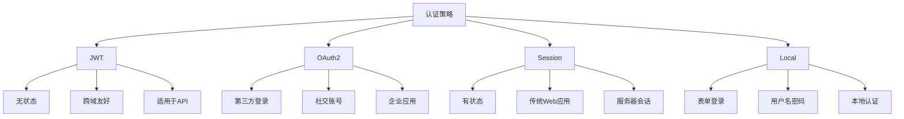

# Aiko Boot 安全组件使用说明

Aiko Boot 安全组件为 AI-First Framework 提供了类似 Spring Boot 的认证和授权功能，支持多种认证策略、基于角色的访问控制（RBAC）和声明式安全配置。

## 目录

- [核心功能](#核心功能)
- [安装与配置](#安装与配置)
- [快速开始](#快速开始)
- [认证策略](#认证策略)
- [权限控制](#权限控制)
- [装饰器详解](#装饰器详解)
- [安全配置](#安全配置)
- [React 集成](#react-集成)
- [最佳实践](#最佳实践)
- [API 参考](#api-参考)

## 核心功能

- **多种认证策略**：支持 JWT、OAuth2、Session、Local 认证方式
- **基于角色的访问控制（RBAC）**：完善的权限管理系统
- **声明式安全配置**：基于装饰器的安全配置，使用简单直观
- **自动配置**：零配置启动，提供合理的默认值
- **类型安全**：完整的 TypeScript 类型支持
- **Java 兼容**：装饰器可转换为 Spring Security 注解

## 安装与配置

### 1、安装依赖

```bash
pnpm add @ai-partner-x/aiko-boot-starter-security
```

### 2、启用安全模块

在应用入口文件中导入安全模块：

```typescript
import { createApp } from '@ai-partner-x/aiko-boot';
import '@ai-partner-x/aiko-boot-starter-security';

const app = await createApp({ srcDir: __dirname });
app.run();
```

### 3、环境准备

确保在 TypeScript 配置文件中启用了装饰器支持：

```json
// tsconfig.json
{
  "compilerOptions": {
    "experimentalDecorators": true,
    "emitDecoratorMetadata": true
  }
}
```

## 快速开始

### 基本使用示例

下面是一个简单的用户管理控制器，展示如何使用安全装饰器：

```typescript
import { RestController, GetMapping, PostMapping } from '@ai-partner-x/aiko-boot-starter-web';
import { Public, PreAuthorize, RolesAllowed } from '@ai-partner-x/aiko-boot-starter-security';

@RestController({ path: '/api/users' })
export class UserController {

  /**
   * 公开接口 - 不需要认证
   */
  @GetMapping('/public')
  @Public()
  async publicInfo(): Promise<any> {
    return { message: '这是公开接口，无需认证' };
  }

  /**
   * 管理员接口 - 需要 ADMIN 角色
   */
  @GetMapping('/admin')
  @PreAuthorize("hasRole('ADMIN')")
  async adminPanel(): Promise<any> {
    return { message: '这是管理员接口' };
  }

  /**
   * 用户列表 - 需要认证
   */
  @GetMapping()
  @Authenticated()
  async list(): Promise<User[]> {
    return this.userService.getAllUsers();
  }

  /**
   * 创建用户 - 需要 ADMIN 或 MANAGER 角色
   */
  @PostMapping()
  @RolesAllowed('ADMIN', 'MANAGER')
  async create(@RequestBody() userData: any): Promise<User> {
    return this.userService.createUser(userData);
  }
}
```

### 配置文件

创建配置文件 `config/app.config.ts`：

```typescript
import type { AppConfig } from '@ai-partner-x/aiko-boot';

export default {
  security: {
    enabled: true,
    jwt: {
      secret: process.env.JWT_SECRET, // 生产环境必须设置！
      expiresIn: '1h', // 生产环境建议设置为较短时间
    },
    cors: {
      enabled: true,
      origin: ['https://yourdomain.com'], // 指定具体的域名
      credentials: true,
    },
    publicPaths: ['/api/auth/login', '/api/auth/register', '/api/public'],
  },
} satisfies AppConfig;
```

## 认证策略

Aiko Boot 安全组件支持四种认证策略：



### JWT 认证

JWT（JSON Web Token）是最常用的无状态认证方式，特别适合前后端分离的应用。

#### 配置 JWT

```typescript
const config = {
  security: {
    jwt: {
      secret: process.env.JWT_SECRET, // 必须设置强密钥
      expiresIn: '1h', // Token 有效期
    },
  },
};
```

#### 生成和验证 Token

```typescript
import { AuthService } from '@ai-partner-x/aiko-boot-starter-security';

@Service()
export class LoginService {
  @Autowired()
  private authService!: AuthService;

  async login(username: string, password: string) {
    // 验证用户凭证
    const user = await this.validateUser(username, password);

    // 生成 Token
    const result = await this.authService.login({
      username,
      password,
    });

    return result; // 包含 user 和 token
  }
}
```

#### 使用 JWT 保护接口

```typescript
import { PreAuthorize } from '@ai-partner-x/aiko-boot-starter-security';

@RestController({ path: '/api' })
export class ApiController {

  @GetMapping('/protected')
  @PreAuthorize("authenticated()")
  async protectedEndpoint() {
    return { message: '此接口需要 JWT 认证' };
  }
}
```

### OAuth2 认证

适用于需要第三方登录的场景，如 Google、GitHub 等社交账号登录。

#### 配置 OAuth2

```typescript
const config = {
  security: {
    oauth2: {
      clientId: process.env.OAUTH2_CLIENT_ID,
      clientSecret: process.env.OAUTH2_CLIENT_SECRET,
      callbackUrl: process.env.OAUTH2_CALLBACK_URL,
      provider: 'google', // 或 'github', 'facebook' 等
    },
  },
};
```

#### OAuth2 登录流程

```typescript
@RestController({ path: '/api/auth' })
export class OAuthController {

  @GetMapping('/oauth/callback')
  async oauthCallback(@Request('query') query: any) {
    const { code, state } = query;

    // 使用 OAuth2Strategy 处理回调
    const user = await this.oauthService.authenticate(code);

    return { user, token: await this.generateToken(user) };
  }
}
```

### Session 认证

传统的有状态认证方式，适合传统的 Web 应用。

#### 配置 Session

```typescript
const config = {
  security: {
    session: {
      secret: process.env.SESSION_SECRET, // 必须设置强密钥
      maxAge: 3600000, // 1小时（毫秒）
      resave: false,
      saveUninitialized: false,
    },
  },
};
```

#### 使用 Session 保护接口

```typescript
@RestController({ path: '/api' })
export class SessionController {

  @GetMapping('/profile')
  @PreAuthorize("authenticated()")
  async getProfile() {
    return this.getCurrentUser();
  }
}
```

### Local 认证

基于用户名密码的本地认证，适合传统的表单登录。

#### 实现登录接口

```typescript
import { AuthService } from '@ai-partner-x/aiko-boot-starter-security';

@RestController({ path: '/api/auth' })
export class AuthController {

  @Autowired()
  private authService!: AuthService;

  @PostMapping('/login')
  @Public()
  async login(@RequestBody() credentials: LoginDto) {
    return await this.authService.login(credentials);
  }

  @PostMapping('/logout')
  async logout() {
    // 清除用户会话
    return { message: '登出成功' };
  }
}
```

## 权限控制

### 权限表达式

安全组件支持丰富的权限表达式语法，用于灵活的权限控制：

| 表达式 | 说明 | 示例 |
|--------|------|------|
| `hasRole('ROLE_NAME')` | 检查用户是否有指定角色 | `hasRole('ADMIN')` |
| `hasAnyRole('ROLE1', 'ROLE2')` | 检查用户是否有任意一个角色 | `hasAnyRole('ADMIN', 'MANAGER')` |
| `hasAllRoles('ROLE1', 'ROLE2')` | 检查用户是否有所有角色 | `hasAllRoles('ADMIN', 'USER')` |
| `hasPermission('permission:name')` | 检查用户是否有指定权限 | `hasPermission('user:read')` |
| `authenticated()` | 检查用户是否已认证 | `authenticated()` |
| `#id == authentication.principal.id` | 检查参数是否等于当前用户ID | `#id == authentication.principal.id` |
| `returnObject.owner == authentication.principal.id` | 检查返回对象的属性（后置授权） | `returnObject.owner == authentication.principal.id` |

### 表达式使用示例

```typescript
@RestController({ path: '/api/users' })
export class UserController {

  /**
   * 只有管理员可以查看所有用户
   */
  @GetMapping()
  @PreAuthorize("hasRole('ADMIN')")
  async list(): Promise<User[]> {
    return this.userService.getAllUsers();
  }

  /**
   * 管理员或本人可以查看用户详情
   */
  @GetMapping('/:id')
  @PreAuthorize("hasRole('ADMIN') or #id == authentication.principal.id")
  async getById(@PathVariable('id') id: number): Promise<User> {
    return this.userService.getUserById(id);
  }

  /**
   * 只有管理员或经理可以创建用户
   */
  @PostMapping()
  @PreAuthorize("hasAnyRole('ADMIN', 'MANAGER')")
  async create(@RequestBody() userData: any): Promise<User> {
    return this.userService.createUser(userData);
  }

  /**
   * 检查返回对象的归属（后置授权）
   */
  @GetMapping('/sensitive/:id')
  @PostAuthorize("returnObject.owner == authentication.principal.id")
  async getSensitiveData(@PathVariable('id') id: number): Promise<SensitiveData> {
    return this.dataService.getSensitiveData(id);
  }

  /**
   * 检查用户是否有特定权限
   */
  @PostMapping('/admin-action')
  @PreAuthorize("hasPermission('admin:action')")
  async adminAction(): Promise<any> {
    return this.service.performAdminAction();
  }
}
```

## 装饰器详解

### 认证装饰器

#### @Public()

标记接口为公开访问，不需要认证。

```typescript
@RestController({ path: '/api' })
export class PublicController {

  @GetMapping('/health')
  @Public()
  async health(): Promise<{ status: string }> {
    return { status: 'ok' };
  }

  @GetMapping('/info')
  @Public()
  async info(): Promise<any> {
    return { version: '1.0.0' };
  }
}
```

#### @Authenticated()

标记接口需要认证，但不限制角色。

```typescript
@RestController({ path: '/api' })
export class AuthenticatedController {

  @GetMapping('/profile')
  @Authenticated()
  async getProfile(): Promise<User> {
    return this.getCurrentUser();
  }

  @GetMapping('/settings')
  @Authenticated()
  async getSettings(): Promise<Settings> {
    return this.getSettingsService();
  }
}
```

#### @RolesAllowed(...roles)

限制只有特定角色的用户可以访问。

```typescript
@RestController({ path: '/api/admin' })
export class AdminController {

  @GetMapping()
  @RolesAllowed('ADMIN')
  async adminPanel(): Promise<any> {
    return this.getAdminData();
  }

  @PostMapping('/users')
  @RolesAllowed('ADMIN', 'MANAGER')
  async createUser(@RequestBody() userData: any): Promise<User> {
    return this.userService.createUser(userData);
  }
}
```

### 权限装饰器

#### @PreAuthorize(expression)

前置授权检查，在方法执行前检查权限。

```typescript
@RestController({ path: '/api/documents' })
export class DocumentController {

  @GetMapping('/:id')
  @PreAuthorize("hasPermission('document:read') or #id == authentication.principal.id")
  async getDocument(@PathVariable('id') id: number): Promise<Document> {
    return this.documentService.getDocument(id);
  }

  @PostMapping()
  @PreAuthorize("hasPermission('document:write')")
  async createDocument(@RequestBody() doc: any): Promise<Document> {
    return this.documentService.createDocument(doc);
  }
}
```

#### @PostAuthorize(expression)

后置授权检查，在方法执行后检查返回结果的权限。

```typescript
@RestController({ path: '/api/sensitive' })
export class SensitiveController {

  @GetMapping('/data/:id')
  @PostAuthorize("returnObject.owner == authentication.principal.id or hasRole('ADMIN')")
  async getSensitiveData(@PathVariable('id') id: number): Promise<SensitiveData> {
    return this.dataService.getSensitiveData(id);
  }
}
```

#### @Secured(...permissions)

基于权限字符串列表的授权，用户需要拥有其中任意一个权限。

```typescript
@RestController({ path: '/api/resources' })
export class ResourceController {

  @PostMapping()
  @Secured('resource:create', 'resource:write')
  async createResource(@RequestBody() data: any): Promise<Resource> {
    return this.resourceService.create(data);
  }

  @DeleteMapping('/:id')
  @Secured('resource:delete', 'resource:admin')
  async deleteResource(@PathVariable('id') id: number): Promise<void> {
    return this.resourceService.delete(id);
  }
}
```

### 新权限类型装饰器

#### @ApiPermission(resource, action, options)

API 端点权限装饰器，用于定义 API 访问权限。

```typescript
@RestController({ path: '/api/users' })
export class UserController {

  @GetMapping()
  @ApiPermission('user', 'read', {
    description: '查看用户列表',
    group: '用户管理',
  })
  async list(): Promise<User[]> {
    return this.userService.getAllUsers();
  }

  @PostMapping()
  @ApiPermission('user', 'create', {
    description: '创建用户',
    group: '用户管理',
  })
  async create(@RequestBody() userData: any): Promise<User> {
    return this.userService.createUser(userData);
  }
}
```

#### @MethodPermission(resource, action, options)

方法权限装饰器，用于 Service 层的方法权限控制。

```typescript
@Service()
export class UserService {

  @MethodPermission('user', 'read', {
    description: '查询用户服务方法',
    group: '用户服务',
  })
  async findAll(): Promise<User[]> {
    return this.userRepository.findAll();
  }

  @MethodPermission('user', 'create', {
    description: '创建用户服务方法',
    group: '用户服务',
  })
  async create(userData: any): Promise<User> {
    return this.userRepository.create(userData);
  }
}
```

#### @ButtonPermission(resource, action, options)

按钮权限装饰器，用于前端按钮的权限控制。

```typescript
@RestController({ path: '/api/orders' })
export class OrderController {

  @GetMapping()
  @ApiPermission('order', 'read', {
    description: '查看订单列表',
    group: '订单管理',
  })
  @ButtonPermission('order', 'export', {
    description: '导出订单按钮',
    group: '订单管理',
    buttonId: 'btn-export-orders',
  })
  @ButtonPermission('order', 'print', {
    description: '打印订单按钮',
    group: '订单管理',
    buttonId: 'btn-print-orders',
  })
  async list(): Promise<Order[]> {
    return this.orderService.findAll();
  }
}
```

#### @RolePermission(...roles)

角色权限装饰器，基于用户角色的权限控制。

```typescript
@RestController({ path: '/api/admin' })
export class AdminController {

  @GetMapping('/panel')
  @RolePermission('ADMIN', 'SUPER_ADMIN')
  async adminPanel(): Promise<any> {
    return this.getAdminData();
  }

  @GetMapping('/settings')
  @RolePermission('ADMIN', 'MANAGER')
  async settings(): Promise<any> {
    return this.getSettings();
  }
}
```

#### @MenuPermission(menuId, options)

菜单权限装饰器，基于菜单标识的权限控制。

```typescript
@RestController({ path: '/api/menu' })
export class MenuController {

  @GetMapping('/user-menu')
  @MenuPermission('user-management', {
    description: '用户管理菜单',
    group: '系统菜单',
  })
  async getUserMenu(): Promise<Menu[]> {
    return this.menuService.getUserMenu();
  }

  @GetMapping('/admin-menu')
  @MenuPermission('admin-panel', {
    description: '管理面板菜单',
    group: '系统菜单',
  })
  async getAdminMenu(): Promise<Menu[]> {
    return this.menuService.getAdminMenu();
  }
}
```

#### @DataPermission(dataScope, options)

数据权限装饰器，基于数据标识的权限控制。

```typescript
@RestController({ path: '/api/data' })
export class DataController {

  @GetMapping('/sensitive')
  @DataPermission('sensitive', {
    description: '敏感数据访问权限',
    group: '数据安全',
  })
  async getSensitiveData(): Promise<any> {
    return this.dataService.getSensitiveData();
  }

  @GetMapping('/confidential')
  @DataPermission('confidential', {
    description: '机密数据访问权限',
    group: '数据安全',
  })
  async getConfidentialData(): Promise<any> {
    return this.dataService.getConfidentialData();
  }
}
```

### 混合使用示例

```typescript
/**
 * 高级权限控制示例
 */
@RestController({ path: '/api/reports' })
export class ReportController {

  /**
   * 生成报表 - 混合使用 API 权限和传统表达式
   * API 权限：api:report:generate
   * 传统表达式：hasRole('ADMIN')
   */
  @GetMapping('/generate')
  @ApiPermission('report', 'generate', {
    description: '生成报表',
    group: '报表管理',
  })
  @PreAuthorize("hasRole('ADMIN') or hasRole('MANAGER')")
  async generate(@RequestBody() params: any): Promise<Report> {
    return this.reportService.generate(params);
  }

  /**
   * 导出报表 - 混合使用 API 权限和按钮权限
   * API 权限：api:report:export
   * 按钮权限：button:report:export
   */
  @PostMapping('/export')
  @ApiPermission('report', 'export', {
    description: '导出报表',
    group: '报表管理',
  })
  @ButtonPermission('report', 'export', {
    description: '导出报表按钮',
    group: '报表管理',
    buttonId: 'btn-export-report',
  })
  async export(@RequestBody() params: any): Promise<any> {
    return this.reportService.export(params);
  }
}
```

## 安全配置

### 基础配置

```typescript
import type { AppConfig } from '@ai-partner-x/aiko-boot';

export default {
  security: {
    // 是否启用安全模块
    enabled: true,

    // JWT 配置
    jwt: {
      secret: process.env.JWT_SECRET, // 必须设置强密钥
      expiresIn: '1h', // Token 有效期
    },

    // CORS 配置
    cors: {
      enabled: true,
      origin: ['https://yourdomain.com'], // 指定具体的域名
      credentials: true,
    },

    // Session 配置
    session: {
      secret: process.env.SESSION_SECRET, // 必须设置强密钥
      maxAge: 3600000, // 1小时（毫秒）
    },

    // 公开路径（不需要认证的路径）
    publicPaths: [
      '/api/auth/login',
      '/api/auth/register',
      '/api/public',
      '/health',
    ],
  },
} satisfies AppConfig;
```

### 环境变量

创建 `.env` 文件：

```bash
# JWT 密钥（生产环境必须设置）
JWT_SECRET=your-very-strong-jwt-secret-key-here

# Session 密钥（生产环境必须设置）
SESSION_SECRET=your-very-strong-session-secret-key-here

# OAuth2 配置（可选）
OAUTH2_CLIENT_ID=your-client-id
OAUTH2_CLIENT_SECRET=your-client-secret
OAUTH2_CALLBACK_URL=http://localhost:3000/api/auth/callback
```

### 生产环境配置

**⚠️ 重要提示：生产环境必须设置强密钥！**

```typescript
const config = {
  security: {
    jwt: {
      // ❌ 永远不要在生产环境使用默认密钥
      // secret: 'your-secret-key' // 不安全！

      // ✅ 使用环境变量
      secret: process.env.JWT_SECRET, // 必须设置！
      expiresIn: '1h', // 生产环境建议设置为较短时间
    },
    session: {
      // ❌ 永远不要在生产环境使用默认密钥
      // secret: 'your-session-secret' // 不安全！

      // ✅ 使用环境变量
      secret: process.env.SESSION_SECRET, // 必须设置！
      maxAge: 3600000, // 1小时
    },
    cors: {
      enabled: true,
      origin: ['https://yourdomain.com'], // 指定具体的域名
      credentials: true,
    },
  },
};
```

## React 集成

### 安装 React 支持

```bash
pnpm add @ai-partner-x/aiko-boot-starter-security
```

### 使用 SecurityProvider

```tsx
import { SecurityProvider, useSecurity, HasPermission } from '@ai-partner-x/aiko-boot-starter-security/react';

function App() {
  return (
    <SecurityProvider>
      <Dashboard />
    </SecurityProvider>
  );
}

function Dashboard() {
  const { user, isAuthenticated, hasRole, hasPermission } = useSecurity();

  if (!isAuthenticated) {
    return <Login />;
  }

  return (
    <div>
      <h1>欢迎，{user.username}</h1>

      {/* 只有有权限的用户才能看到 */}
      <HasPermission permission="user:read">
        <UserList />
      </HasPermission>

      {/* 只有管理员才能看到 */}
      {hasRole('ADMIN') && <AdminPanel />}
    </div>
  );
}
```

### 使用权限守卫组件

```tsx
import { HasPermission, HasRole, Authenticated } from '@ai-partner-x/aiko-boot-starter-security/react';

function UserList() {
  return (
    <div>
      <h2>用户列表</h2>

      {/* 只有有创建权限的用户才能看到创建按钮 */}
      <HasPermission permission="user:create">
        <button>创建用户</button>
      </HasPermission>

      <table>
        {/* 表格内容 */}
      </table>

      {/* 只有有删除权限的用户才能看到删除按钮 */}
      <HasPermission permission="user:delete">
        <button>删除用户</button>
      </HasPermission>
    </div>
  );
}

function AdminPanel() {
  return (
    <HasRole roles={['ADMIN', 'SUPER_ADMIN']}>
      <div>
        <h2>管理面板</h2>
        {/* 管理功能 */}
      </div>
    </HasRole>
  );
}
```

### 使用自定义钩子

```tsx
import { useSecurity } from '@ai-partner-x/aiko-boot-starter-security/react';

function UserProfile() {
  const { user, isAuthenticated, hasPermission } = useSecurity();

  if (!isAuthenticated) {
    return <div>请先登录</div>;
  }

  return (
    <div>
      <h1>用户资料</h1>
      <p>用户名：{user.username}</p>
      <p>邮箱：{user.email}</p>

      {hasPermission('user:update') && (
        <button>编辑资料</button>
      )}
    </div>
  );
}
```

## 最佳实践

### 1、生产环境安全配置

**⚠️ 永远不要在生产环境使用默认密钥！**

```typescript
// ❌ 危险操作
const config = {
  security: {
    jwt: { secret: 'your-secret-key' } // 不安全！
  }
};

// ✅ 正确做法
const config = {
  security: {
    jwt: {
      secret: process.env.JWT_SECRET, // 必须设置！
      expiresIn: '1h'
    },
    session: {
      secret: process.env.SESSION_SECRET // 必须设置！
    }
  }
};
```

### 2、速率限制

保护认证端点免受暴力攻击：

```typescript
import express from 'express';
import rateLimit from 'express-rate-limit';

// 登录端点速率限制
const loginLimiter = rateLimit({
  windowMs: 15 * 60 * 1000, // 15分钟
  max: 5, // 每个窗口最多5次尝试
  message: { error: '登录尝试次数过多，请稍后再试' },
  standardHeaders: true,
  legacyHeaders: false,
});

// 应用到登录端点
app.post('/api/auth/login', loginLimiter, authController.login);

// 密码重置更严格的速率限制
const passwordResetLimiter = rateLimit({
  windowMs: 60 * 60 * 1000, // 1小时
  max: 3, // 每小时最多3次
});

app.post('/api/auth/forgot-password', passwordResetLimiter, authController.forgotPassword);
```

### 3、密码安全

- 使用强密码哈希（bcrypt，cost factor >= 10）
- 强制最小密码长度（>= 8个字符）
- 考虑密码复杂度要求
- 实现密码泄露检测

```typescript
// 强密码验证示例
const validatePassword = (password: string): boolean => {
  if (password.length < 8) return false;
  if (!/[A-Z]/.test(password)) return false; // 大写字母
  if (!/[a-z]/.test(password)) return false; // 小写字母
  if (!/[0-9]/.test(password)) return false; // 数字
  if (!/[!@#$%^&*]/.test(password)) return false; // 特殊字符
  return true;
};
```

### 4、Token 安全

- 使用较短的访问 Token 有效期（15-60分钟）
- 实现 Token 轮换
- 安全存储 Token（Web 使用 httpOnly cookies）
- 实现登出时的 Token 撤销

```typescript
const config = {
  security: {
    jwt: {
      secret: process.env.JWT_SECRET,
      expiresIn: '15m', // 较短的访问 Token 有效期
    },
    refreshToken: {
      secret: process.env.REFRESH_TOKEN_SECRET,
      expiresIn: '7d', // 较长的刷新 Token 有效期
    },
  },
};
```

### 5、CORS 配置

始终指定具体的源，不要使用通配符：

```typescript
const config = {
  security: {
    cors: {
      enabled: true,
      origin: ['https://yourdomain.com', 'https://app.yourdomain.com'], // 指定具体的域名
      credentials: true,
      methods: ['GET', 'POST', 'PUT', 'DELETE', 'PATCH'],
      allowedHeaders: ['Content-Type', 'Authorization'],
    }
  }
};
```

### 6、敏感数据保护

框架会自动排除敏感字段：

```typescript
// 以下字段会自动从 API 响应中排除：
// - password, passwordHash
// - salt, token, refreshToken
// - secret, apiKey, privateKey
```

### 7、权限设计原则

- **最小权限原则**：用户只拥有完成其工作所需的最小权限
- **权限分离**：将读权限和写权限分开
- **角色层次**：设计清晰的角色层次结构
- **审计日志**：记录所有敏感操作

```typescript
// 权限设计示例
const permissions = {
  // 基础权限
  'user:read': '查看用户',
  'user:create': '创建用户',
  'user:update': '更新用户',
  'user:delete': '删除用户',

  // 高级权限
  'user:reset-password': '重置密码',
  'user:assign-role': '分配角色',
  'user:manage-permissions': '管理权限',

  // 管理权限
  'admin:system': '系统管理',
  'admin:config': '配置管理',
};
```

## API 参考

### AuthService

认证服务，提供登录、注册、Token 管理等功能。

```typescript
interface AuthService {
  /**
   * 用户登录
   */
  login(credentials: LoginDto): Promise<LoginResult>;

  /**
   * 用户注册
   */
  register(userData: RegisterDto): Promise<User>;

  /**
   * 刷新 Token
   */
  refreshToken(refreshToken: string): Promise<LoginResult>;

  /**
   * 用户登出
   */
  logout(token: string): Promise<void>;

  /**
   * 修改密码
   */
  changePassword(
    userId: number,
    oldPassword: string,
    newPassword: string
  ): Promise<boolean>;
}
```

#### 使用示例

```typescript
@Service()
export class AuthControllerService {
  @Autowired()
  private authService!: AuthService;

  async login(username: string, password: string) {
    const result = await this.authService.login({
      username,
      password,
    });

    return result; // { user, token, expiresIn }
  }
}
```

### PermissionService

权限服务，提供权限检查和验证功能。

```typescript
interface PermissionService {
  /**
   * 检查用户是否有指定权限
   */
  hasPermission(user: User, permission: string): Promise<boolean>;

  /**
   * 检查用户是否有所有指定权限
   */
  hasPermissions(user: User, permissions: string[]): Promise<boolean>;

  /**
   * 检查用户是否有任意一个指定权限
   */
  hasAnyPermission(user: User, permissions: string[]): Promise<boolean>;

  /**
   * 检查用户是否有指定角色
   */
  hasRole(user: User, role: string): boolean;

  /**
   * 检查用户是否有所有指定角色
   */
  hasAllRoles(user: User, roles: string[]): boolean;

  /**
   * 检查用户是否有任意一个指定角色
   */
  hasAnyRole(user: User, roles: string[]): boolean;
}
```

#### 使用示例

```typescript
@Service()
export class PermissionCheckService {
  @Autowired()
  private permissionService!: PermissionService;

  async canDeleteUser(user: User): Promise<boolean> {
    return await this.permissionService.hasPermission(user, 'user:delete');
  }

  async isAdminOrManager(user: User): boolean {
    return this.permissionService.hasAnyRole(user, ['ADMIN', 'MANAGER']);
  }
}
```

### SecurityContext

安全上下文，提供当前用户信息和权限检查。

```typescript
interface SecurityContext {
  /**
   * 获取当前用户
   */
  getCurrentUser(): User | null;

  /**
   * 设置当前用户
   */
  setCurrentUser(user: User | null): void;

  /**
   * 检查是否已认证
   */
  isAuthenticated(): boolean;

  /**
   * 检查是否有指定角色
   */
  hasRole(role: string): boolean;

  /**
   * 清除安全上下文
   */
  clear(): void;
}
```

#### 使用示例

```typescript
@Service()
export class BusinessService {
  private context = SecurityContext.getInstance();

  async getCurrentUserId(): number | null {
    const user = this.context.getCurrentUser();
    return user?.id || null;
  }

  async isCurrentUserAdmin(): boolean {
    return this.context.hasRole('ADMIN');
  }
}
```

### JwtStrategy

JWT 认证策略。

```typescript
interface JwtStrategy extends IAuthStrategy {
  name: string;
  authenticate(request: any): Promise<User | null>;
  validate(token: string): Promise<User | null>;
  generateToken(user: User): Promise<string>;
}
```

### PermissionGuard

权限守卫，用于检查方法级别的权限。

```typescript
interface PermissionGuard {
  /**
   * 检查是否允许访问
   */
  canActivate(context: any): Promise<boolean>;
}
```

### PermissionExpressionParser

权限表达式解析器，用于解析和执行权限表达式。

```typescript
interface PermissionExpressionParser {
  /**
   * 解析权限表达式
   */
  parse(expression: string, context: any): boolean;
}
```

## 常见问题

### Q1: 如何自定义认证策略？

A: 实现 `IAuthStrategy` 接口，并注册为 Bean：

```typescript
import { IAuthStrategy } from '@ai-partner-x/aiko-boot-starter-security';

@Component()
export class CustomAuthStrategy implements IAuthStrategy {
  name = 'custom';

  async authenticate(request: any): Promise<User | null> {
    // 自定义认证逻辑
    return null;
  }

  async validate(token: string): Promise<User | null> {
    // 自定义验证逻辑
    return null;
  }

  async generateToken(user: User): Promise<string> {
    // 自定义 Token 生成逻辑
    return '';
  }
}
```

### Q2: 如何实现权限的动态配置？

A: 使用 PermissionService 动态检查权限：

```typescript
@Service()
export class DynamicPermissionService {
  @Autowired()
  private permissionService!: PermissionService;

  async checkPermission(
    userId: number,
    resource: string,
    action: string
  ): Promise<boolean> {
    const user = await this.getUserById(userId);
    const permission = `${resource}:${action}`;
    return await this.permissionService.hasPermission(user, permission);
  }
}
```

### Q3: 如何处理 Token 过期？

A: 实现刷新 Token 机制：

```typescript
@Service()
export class TokenService {
  @Autowired()
  private authService!: AuthService;

  async refreshAccessToken(refreshToken: string) {
    try {
      const result = await this.authService.refreshToken(refreshToken);
      return { token: result.token, expiresIn: result.expiresIn };
    } catch (error) {
      throw new Error('刷新 Token 失败');
    }
  }
}
```

### Q4: 如何实现多租户权限控制？

A: 在权限表达式中包含租户信息：

```typescript
@RestController({ path: '/api/tenant' })
export class TenantController {

  @GetMapping('/data')
  @PreAuthorize("#tenantId == authentication.principal.tenantId")
  async getTenantData(
    @PathVariable('tenantId') tenantId: number
  ): Promise<any> {
    return this.tenantService.getData(tenantId);
  }
}
```

## 总结

Aiko Boot 安全组件提供了完整的认证和授权解决方案，支持多种认证策略和灵活的权限控制。通过使用声明式装饰器，可以轻松实现安全控制，同时保持代码的简洁和可维护性。

**关键要点：**

1. ✅ 使用装饰器简化权限控制
2. ✅ 生产环境必须设置强密钥
3. ✅ 实施速率限制防止暴力攻击
4. ✅ 使用较短的 Token 有效期
5. ✅ 定期更新密钥和证书
6. ✅ 记录所有敏感操作的审计日志
7. ✅ 遵循最小权限原则

如有问题或建议，请访问项目仓库提交 Issue。
